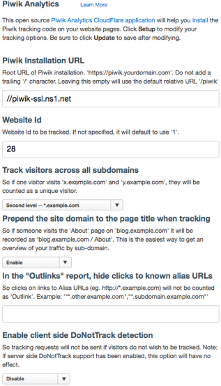
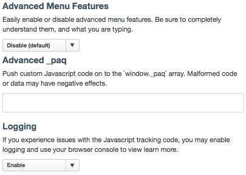

# Miniature Hipster:
## A Piwik App for CloudFlare -- cfapp_piwik_analytics
------------------------------------------------------
[Piwik Analytics](https://www.cloudflare.com/apps/piwik_analytics) CloudFlare App.

**Miniature Hipster** is the 'random' new project name provided by [Github](https://github.com/new). I enjoy it, although may change it. But it's kind of interesting.
  * It is written primarily in [CoffeeScript](http://coffeescript.org/), and compiled into Javascript.

### Initially this app aims to
  * Be asynchronous in loading
  * Support a single Piwik Site ID
  * Support a single Piwik tracker/receiver
  * Work with your own Piwik Analytics installation, or maybe a hosted solution,
  * Improve upon the available Analytics &amp; Tracking options available to CloudFlare users.

### TODO Future
* Utililse "use strict;" when possible for development
* Utilise [cdnjs](http://cdnjs.com/#piwik) for serving piwik.js quickly if enabled, or the parameters are left unsupplied by the user.

* Support:
  * [cookie configuration for domains and sub-domains](http://piwik.org/docs/javascript-tracking/#toc-cookie-configuration-for-domains-and-subdomains)
  * goals, tracking, 5 per site id, maybe more.
  * eventually support [all methods available in the Tracking API](http://piwik.org/docs/javascript-tracking/#toc-list-of-all-methods-available-in-the-tracking-api)
* Describe the [test app](./test) better, and it's individual files.

### IMPOSSIBLE! 
  * provide &lt;noscript&gt; tag for recording visitors without Javascript using a 1x1 gif pixel; CloudFlare no longer supports applications which are not loaded as Javascript modules.

Contributing
------------

1. Fork it on Github.
2. Clone to your local machine.
  * SSH: (`git clone "git@github.com:px/cfapp-piwik-analytics.git"`)
  * HTTPS: (`git clone "https://github.com/px/cfapp-piwik-analytics.git"`)
3. Checkout and create a new branch (`git checkout -b my_new_feature`)
4. Commit your changes, preferably one commit per file. (`git commit -am "Added my new feature"`)
5. Push to the branch (`git push origin my_new_feature`)
6. Open a Pull Request
7. Enjoy a refreshing glass of water and wait

Process Notes
-------------
* New versions TODO
  * better describe the process
  * npm -- there is a [package.json](package.json) to help with dependencies.
   * Install package dependecies - (`npm install -d`)

    * automatically compile changes to coffeescript files within this project using the [Cakefile](Cakefile) script. (`cake bake`)
    * test compiled javascript using [local testing](test/index.html)
    * test compiled javascript using [js.cloudflare.com](http://js.cloudflare.com/)
      * [pbcopy](http://developer.apple.com/library/mac/documentation/Darwin/Reference/ManPages/man1/pbcopy.1.html) is your friend. (`pbcopy < public/javascripts/piwik_analytics.js`)
    * Validation: (`./validate.sh`)
      * automatically validate and check cloudflare.json &amp; and soon other json files with jsonlint

    * which files need to version bump;
      * [Cakefile](Cakefile) -- top of file
      * [cloudflare.json](cloudflare.json) -- end of file
      * [package.json](package.json) -- top of file

    * `git commit cloudflare.json package.json Cakefile -m "version bump"`
    * `git tag <version>`

    * Once you are happy, proceed to push your new version as follows.
      1. [login to CloudFlare](https://www.cloudflare.com/login)
      2. [App Developer Dashboard](https://www.cloudflare.com/app-signup)
      3. click on "more", then "Pull new version" button. Now WAIT! Here be dragons.

Piwik Documentation
-------------------

 * [Online Videos about Piwik](https://piwik.org/blog/category/videos/)
 * [Piwik Javascript Tracking](http://piwik.org/docs/javascript-tracking/)

About CloudFlare Apps
---------------------
CloudFlare's Apps platform enables developers to create and publish web applications for use by website owners on CloudFlare's network. See the [full list](https://www.cloudflare.com/apps).

* Developer documentation [cloudflare.json manifest](http://appdev.cloudflare.com/next/cloudflare-json.html)

Logo
----

These are the current logo images used with this application. They are rendered using the [update-logo-piwik-high-res.sh](update-logo-piwik-high-res.sh) bash script which will download a high-resolution logo, and resize it accordingly.

* 200x

* 132x

Screenshots
-----------

These are the current screenshots used for display within the app details page.

* Features

* Advanced Menu Features

#### My tracking pixels

Thanks for visiting!

